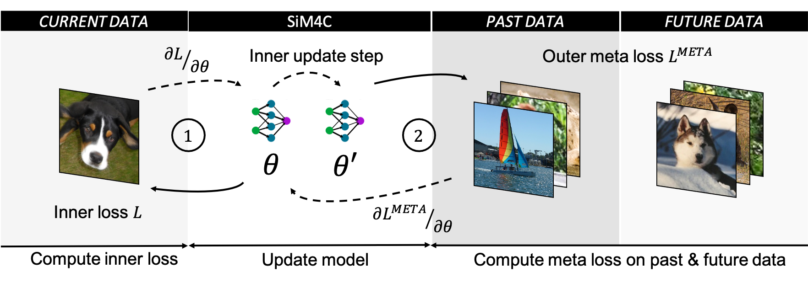
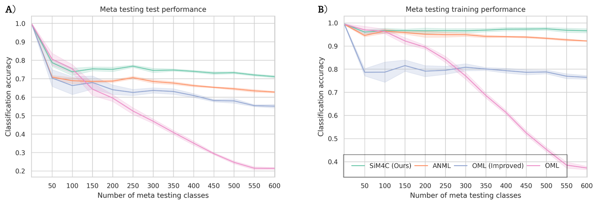

# A Simple Recipe to Meta-Learn Forward and Backward Transfer

<div>

</div>


This repository contains the code for the main meta pre-training experiments with *the simple meta-learning algorithm for continual learning* (SiM4C) from the ICCV paper [*A Simple Recipe to Meta-Learn Forward and Backward Transfer*](https://openaccess.thecvf.com/content/ICCV2023/html/Cetin_A_Simple_Recipe_to_Meta-Learn_Forward_and_Backward_Transfer_ICCV_2023_paper.html).
The code to download and preprocess the Omniglot dataset is based on the prior meta pre-training implementation from [Javed et al. 2019](https://github.com/khurramjaved96/mrcl).


## Installation

We provide a configuration file to easily install dependencies via [conda](https://docs.conda.io/projects/conda/en/latest/user-guide/install/linux.html):
```sh
conda env create -f conda_env.yml
conda activate metaL
```

## Replicating the results with SiM4C

<div>

</div>


We provide a simple script to replicate our main experiments with SiM4C:

To perform both meta pre-training and meta-testing, run:

```setup
./scripts/train_sim4c.sh
```

To re-run meta-testing with different configurations, check the location of the experiment folder (ending in the current
date) and run:

```setup
python eval_all.py experiment_path=path/to/experiment/folder
```


To run and evaluate alternative baselines execute _train.py_ and _eval.py_/_eval_all.py_ overriding the appropriate arguments 
(see [hydra](https://hydra.cc/docs/intro/) for details).

## Reference

To reference this work in future research, you can use the following:

```setup
@InProceedings{Cetin_2023_ICCV,
    author    = {Cetin, Edoardo and Carta, Antonio and Celiktutan, Oya},
    title     = {A Simple Recipe to Meta-Learn Forward and Backward Transfer},
    booktitle = {Proceedings of the IEEE/CVF International Conference on Computer Vision (ICCV)},
    month     = {October},
    year      = {2023},
    pages     = {18732-18742}
}
```
